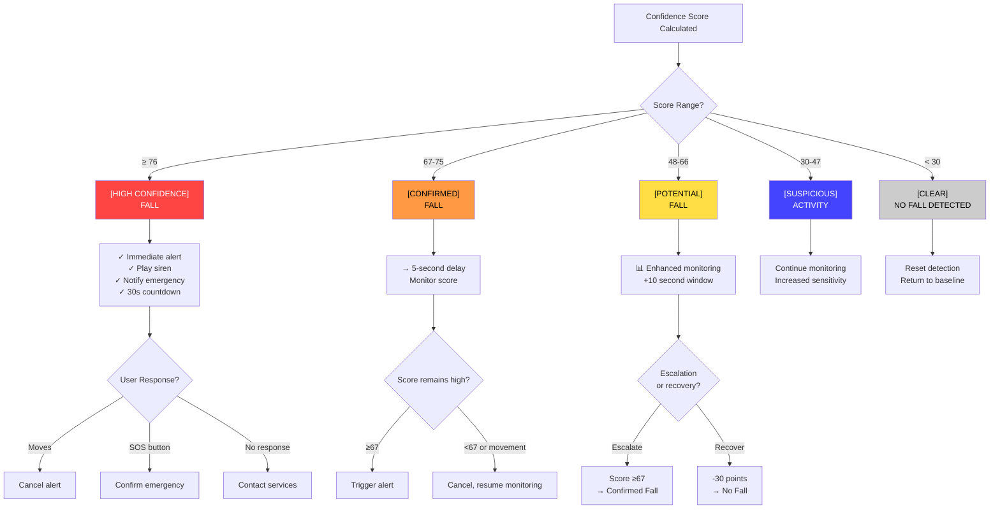
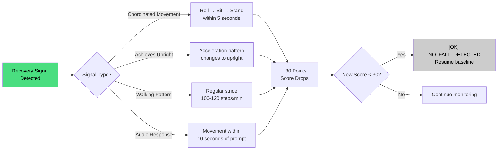
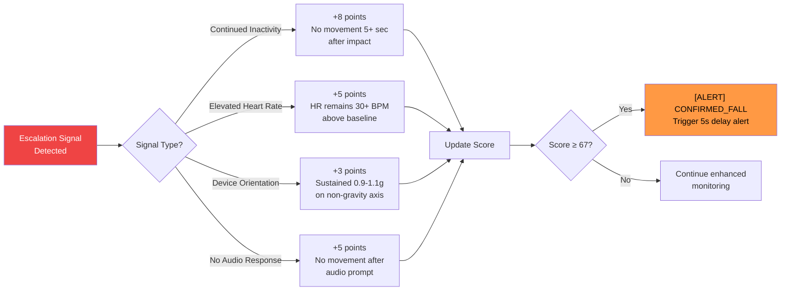

# Confidence Scoring & Classification

Final stage of the SmartFall algorithm: converting raw stage points into actionable alerts.

## Total Confidence Calculation

The confidence score is the sum of all stage points:

```
Total Confidence = Stage1_Points + Stage2_Points + Stage3_Points
                   + Stage4_Points + Stage5_Points

Maximum Possible = 25 + 25 + 20 + 20 + 15 = 105 points
```

### Example Calculation

**Scenario: Elderly person falls backward from standing**

```
Stage 1 (Free Fall):        18 pts  (350ms duration, 0.2g magnitude)
Stage 2 (Impact):           20 pts  (5.5g impact, immediate timing)
Stage 3 (Rotation):         14 pts  (380°/s rotation, 75° change)
Stage 4 (Inactivity):       18 pts  (3.2s motionless)
Stage 5 (Filters):          12 pts  (0.8m altitude drop + HR spike)
────────────────────────────────────
TOTAL CONFIDENCE:           82 pts

Classification: HIGH_CONFIDENCE_FALL → Immediate Alert
```

## Classification Thresholds

SmartFall uses these fixed thresholds to classify falls:

!!! warning "Threshold Values"
    **Config.h values are authoritative.** These differ from the specification:
    - Config.h: 76/67/48/29
    - Specification: 80/70/50/30

    Use the code values below.

### Threshold Definitions

```
Confidence Scale (0-105 points)

     105 ┤
         │
      80 ├─────────┐
         │         │ HIGH_CONFIDENCE_FALL (≥76)
      76 ├────┐    │ Immediate alert, no delay
         │    │    │
      70 ├────┤────┴─ CONFIRMED_FALL (67-75)
         │    │       5-second delay before alert
      67 ├────┘
         │
      60 ├──────────┐
         │          │ POTENTIAL_FALL (48-66)
      50 ├──┐       │ Extended monitoring (10s)
         │  │       │
      48 ├──┘───────┘
         │
      40 ├──────────┐
         │          │ SUSPICIOUS_ACTIVITY (30-47)
      30 ├──────────┘ Normal monitoring, increased sensitivity
         │
       0 └──────────── NO_FALL_DETECTED (<30)
```

### Detailed Threshold Table

| Score | Status | Action | Delay | Confidence |
|-------|--------|--------|-------|-----------|
| **≥ 76** | HIGH_CONFIDENCE_FALL | Immediate alert | 0 sec | 95%+ |
| **67-75** | CONFIRMED_FALL | Alert after delay | 5 sec | 85% |
| **48-66** | POTENTIAL_FALL | Enhanced monitor | — | 60% |
| **30-47** | SUSPICIOUS_ACTIVITY | Normal monitor | — | 30% |
| **< 30** | NO_FALL_DETECTED | Reset | — | <10% |

### Actual Config.h Values

```cpp
#define HIGH_CONFIDENCE_THRESHOLD  76    // ≥76: immediate alert
#define CONFIRMED_THRESHOLD        67    // 67-75: 5s delay alert
#define POTENTIAL_THRESHOLD        48    // 48-66: enhanced monitor
#define SUSPICIOUS_THRESHOLD       29    // 30-47: normal monitor
                                         // <30: no fall
```

## Fall Status Enum

```cpp
enum FallStatus_t {
    NO_FALL_DETECTED = 0,           // Score < 30
    SUSPICIOUS_ACTIVITY = 1,        // Score 30-47
    POTENTIAL_FALL = 2,             // Score 48-66
    CONFIRMED_FALL = 3,             // Score 67-75
    HIGH_CONFIDENCE_FALL = 4,       // Score ≥76
    SOS_TRIGGERED = 5               // Manual button press
};
```

## Alert Decision Matrix



### Detailed Thresholds

**HIGH_CONFIDENCE_FALL (≥76 points)**
- **Action**: IMMEDIATE alert (no delay)
- **Rationale**: 76+ points indicates a highly confident fall. Delay would endanger the user.
- **Response Options**:
  - User moves significantly → Cancel alert
  - SOS button pressed → Confirm emergency
  - No response (30s) → Contact emergency services

**CONFIRMED_FALL (67-75 points)**
- **Action**: DELAYED alert (5-second wait)
- **Rationale**: At this borderline score, 5 seconds allows the person to move if they're OK, preventing false alarms.
- **Monitoring**: Check if score remains ≥67 or if user moves

**POTENTIAL_FALL (48-66 points)**
- **Action**: Enhanced monitoring mode (10 more seconds)
- **Rationale**: Score suggests possible fall, but recovery is likely. Extended monitoring with escalation logic.
- **Can escalate to**: CONFIRMED_FALL if inactivity continues
- **Can downgrade to**: NO_FALL if clear recovery detected

**SUSPICIOUS_ACTIVITY (30-47 points)**
- **Action**: Continue normal monitoring with increased sensitivity
- **Rationale**: Some criteria met, but score too low for alert
- **Possible causes**: Exercise, quick recovery, false trigger
- **Next step**: Recalculate if additional motion detected

**NO_FALL_DETECTED (<30 points)**
- **Action**: Reset detection state, return to baseline monitoring
- **Rationale**: Sensors haven't detected fall pattern

## Enhanced Monitoring Decision Logic

When confidence is POTENTIAL_FALL (48-66), SmartFall enters enhanced monitoring:

### Recovery Signals (Downgrade)

If any of these occur, **subtract 30 points**:



**Result**: Confidence drops below 30 → NO_FALL_DETECTED, resume normal monitoring

### Escalation Signals (Upgrade)

If any of these occur, **add points**:



**Result**: Score reaches ≥67 → CONFIRMED_FALL, trigger alert with 5-second delay

## SOS Button Override

The SOS button (GPIO 15) bypasses all detection stages:

```cpp
if (sosButtonPressed) {
    confidence_score = 100;  // Override
    status = SOS_TRIGGERED;
    playEmergencyAlert();
    sendEmergencyNotification();
}
```

**SOS Logic**:
- Any time: Immediate emergency alert
- During fall detection: Confirms that the event is real
- Purpose: User manual override for medical emergencies

## Scoring Example: False Positive Scenario

**Scenario**: Dropping device from desk while standing

```
Stage 1: Brief free fall (0.3s) = 10 pts
Stage 2: No impact (device caught) = 0 pts
         ────────────────────────────
Subtotal: 10 pts

OR

Stage 1: Free fall detected = 10 pts
Stage 2: High acceleration (caught by hand) = 8 pts
         (But no sustained inactivity)
Stage 3: Minor rotation = 0 pts
Stage 4: Immediate recovery (standing still) = 0 pts
         ────────────────────────────────
Subtotal: 18 pts

Status: NO_FALL_DETECTED (< 30) ✓ Correctly avoided false alarm
```

## Scoring Example: True Fall Scenario

**Scenario**: Actual fall down two steps

```
Stage 1: Free fall 400ms = 10 pts (0.2g minimum)
Stage 2: Impact 4.2g = 12 pts + timing 3 pts + FSR 7 pts = 22 pts
Stage 3: Rotation 350°/s = 8 pts + 70° change = 3 pts = 11 pts
Stage 4: Inactivity 3.5s = 8 pts + stability 5 pts = 13 pts
Stage 5: Altitude 1.2m = 3 pts + HR spike = 5 pts = 8 pts
         ────────────────────────────────────────────────
TOTAL: 10 + 22 + 11 + 13 + 8 = 64 pts

Status: POTENTIAL_FALL (48-66)
Action: Enhanced monitoring for 10 seconds
        If person doesn't get up → Escalate to CONFIRMED_FALL
```

## Practical Implications

### Emergency First Responders

```
Score < 30:    May call back to verify
Score 30-66:   Optional verification call before dispatch
Score ≥67:     Dispatch emergency services immediately
```

### Mobile App Display

```
Score Visualization:
  0-29:    Green "OK" indicator
 30-47:    Yellow "Caution" indicator
 48-66:    Orange "Alert" with monitoring status
 67-75:    Red "Fall Detected" with 5-second countdown
 ≥76:      Red "Emergency" with immediate dispatch

Real-time updates sent to app every 100ms
```

## Configuration Adjustments

To modify sensitivity, edit `Config.h`:

```cpp
// More sensitive (catches more falls, more false positives)
#define HIGH_CONFIDENCE_THRESHOLD  70    // Lower threshold
#define CONFIRMED_THRESHOLD        60
#define POTENTIAL_THRESHOLD        40

// Less sensitive (misses more falls, fewer false positives)
#define HIGH_CONFIDENCE_THRESHOLD  85    // Higher threshold
#define CONFIRMED_THRESHOLD        75
#define POTENTIAL_THRESHOLD        55
```

## Next Steps

1. **Testing**: See [Fall Simulation Tests](../testing/fall-simulation.md)
2. **Implementation**: See [Fall Detection Code](../firmware/fall-detection.md)
3. **Troubleshooting**: See [Troubleshooting Guide](../troubleshooting.md)
4. **Configuration**: See [Config Reference](../configuration/config-reference.md)
