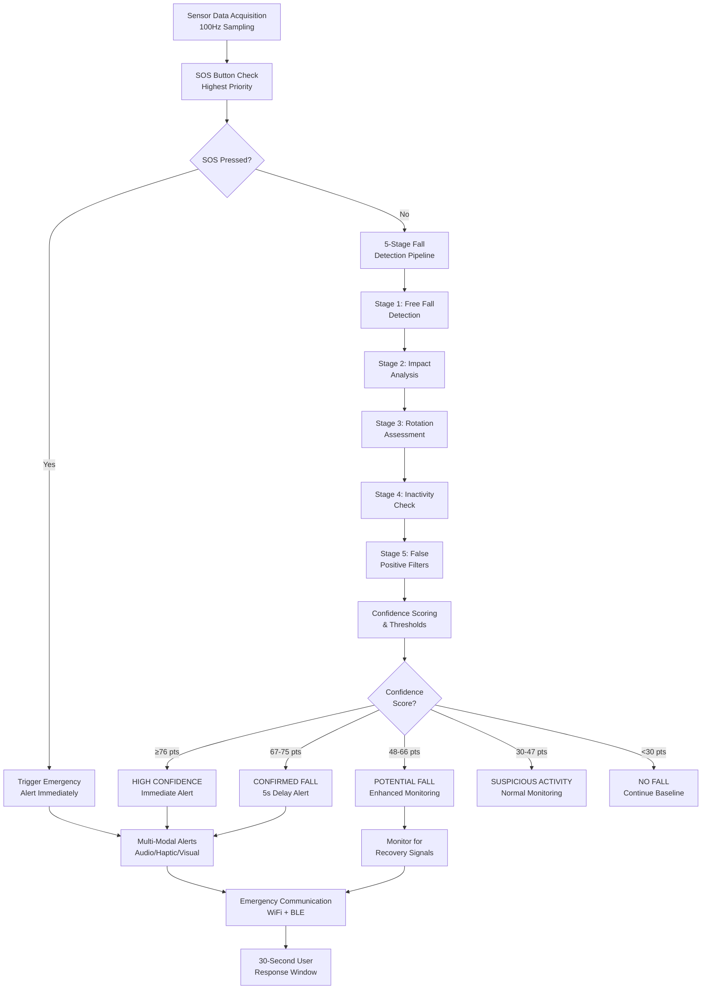

# Algorithm Overview

Comprehensive overview of the SmartFall multi-stage fall detection algorithm design philosophy and processing flow.

## Design Philosophy

SmartFall uses a **staged decision tree approach** rather than a single mathematical equation to provide:

### 1. Interpretable Logic Flow
Each stage has clear, understandable detection criteria that can be validated independently. This makes debugging easier and builds confidence in the system.

### 2. Memory Efficiency
A decision tree approach requires minimal memory compared to complex machine learning models, suitable for microcontroller constraints.

### 3. Tunable Thresholds
All detection parameters live in `Config.h` and can be adjusted without recompilation, enabling quick optimization with real-world data.

### 4. Multiple Validation Stages
Sequential stages act as validators for each other, reducing false positives while maintaining responsiveness.

## Processing Flow

The complete algorithm operates in a continuous loop:



## Timing Architecture

### Sensor Data Acquisition
- **Frequency**: 100 Hz (10ms intervals)
- **Latency**: <5ms from sensor reading to algorithm processing
- **Resolution**: Sufficient to capture fall dynamics

### Detection Window
- **Primary**: 10 seconds of active analysis
- **Extended**: Additional 10 seconds in enhanced monitoring
- **History Buffer**: Maintains last 100 samples (~1 second)

### Alert Response
- **Detection to First Alert**: <2 seconds
- **Alert Duration**: 5 seconds siren + 25 seconds wait
- **Total Response Window**: 30 seconds

## Multi-Stage Architecture

### Why 5 Stages?

A fall event follows a predictable physical sequence:

```
Real Fall Timeline:
├─ T0:    Initial loss of balance
├─ T1:    Free fall begins (acceleration <0.5g)
├─ T2:    User rotates uncontrollably
├─ T3:    Impact with ground (acceleration >3g)
└─ T4:    User remains incapacitated
            (acceleration 0.8-1.2g, no movement)

Each stage confirms the previous:
  No Stage 1 → Not a fall
  No Stage 2 after Stage 1 → Not a fall
  No Stage 3-4 → Possible false positive
```

### Stage Interdependencies

```
Stage 1 (Free Fall)
    ├─→ Required for Stages 2-4
    └─→ Independent false positive filter

Stage 2 (Impact)
    ├─→ Confirms stage 1 (validates free fall)
    └─→ Timing-dependent on stage 1

Stage 3 (Rotation)
    ├─→ Validates uncontrolled motion
    └─→ Rules out self-caught falls

Stage 4 (Inactivity)
    ├─→ Confirms user incapacity
    └─→ Discriminates from falls where user stands up

Stage 5 (Filters)
    ├─→ Final validation using secondary sensors
    └─→ Reduces false positives without delaying true falls
```

## Confidence Scoring System

Instead of binary yes/no decisions, SmartFall accumulates **confidence points** (0-105 total):

### Maximum Points per Stage

| Stage | Max Points | Focus |
|-------|-----------|-------|
| **Stage 1** | 25 pts | Free fall detection |
| **Stage 2** | 25 pts | Impact confirmation |
| **Stage 3** | 20 pts | Rotation validation |
| **Stage 4** | 20 pts | Incapacity duration |
| **Stage 5** | 15 pts | False positive filtering |
| **TOTAL** | **105 pts** | Comprehensive score |

### Scoring Formula

```
Total Confidence = Σ(Stage Points) + Σ(Filter Points)

Then classify:
├─ ≥76 pts:  HIGH CONFIDENCE → Immediate alert
├─ 67-75 pts: CONFIRMED → 5-second delay
├─ 48-66 pts: POTENTIAL → Monitor 10 more seconds
├─ 30-47 pts: SUSPICIOUS → Continue normal monitoring
└─ <30 pts:   NO FALL → Reset
```

## Decision Logic Thresholds

```
Confidence Points
     105 ┤
         │                                   ╱ HIGH CONFIDENCE
         │                                ╱│ Immediate alert
      76 ├───────────────────────────────╱──┤
         │                            ╱│ CONFIRMED
      67 ├────────────────────────╱───┤│ 5s delay alert
         │                    ╱│ POTENTIAL
      48 ├─────────────────╱───┤│ Extended monitoring
         │             ╱│ SUSPICIOUS
      30 ├──────────╱───┤│ Normal monitoring
         │      ╱│ NO FALL
       0 └────╱──────────────────────────────
             Detection      Stages 1-5 Process
```

## Real-World Example: Backward Fall

```
Event Timeline:
T=0ms:   Person loses balance (backward motion detected)
T=150ms: Free fall begins (acceleration drops to 0.2g) → Stage 1: +15 pts
T=400ms: Head impacts floor (8g acceleration spike) → Stage 2: +15 pts
T=450ms: User rotating backward (520°/s gyro) → Stage 3: +12 pts
T=2500ms: User immobilized on floor → Stage 4: +18 pts
T=3000ms: Heart rate spike detected (+35 BPM) → Stage 5: +8 pts

──────────────────────────────────────────────────────────
Total Confidence Score: 15 + 15 + 12 + 18 + 8 = 68 pts

Status: CONFIRMED_FALL
Action: 5-second audio alert, then emergency transmission
```

## Adaptive Behavior

### Enhanced Monitoring Mode (Potential Fall)

When confidence is 48-66 points:

1. **Continue analysis for 10 additional seconds**
2. **Monitor for recovery signals**:
   - Coordinated movement patterns
   - Return to upright position
   - Normal walking resumption

3. **Upgrade to Fall if**:
   - No recovery detected AND
   - Heart rate remains elevated AND
   - Device orientation suggests lying down

### User Response Window

After alert activation:

```
T=0:    Alert triggered (audio + haptic + visual)
T=0-5:  Loud siren
T=5-30: Reduced volume alert every 5 seconds
T=30:   Emergency contacts notified

During window:
├─ User moves significantly → Alert cancelled
├─ SOS button pressed → Immediate notification
└─ No response → Emergency services contacted
```

## False Positive Reduction Strategy

SmartFall prevents false alarms through:

### 1. Sequential Validation
Each stage must be triggered in order. A fall without free fall isn't detected.

### 2. Timing Constraints
Stages must occur within specific time windows (free fall then impact within 1 second).

### 3. Multi-Sensor Confirmation
Secondary sensors (pressure, heart rate, FSR) validate primary motion sensors.

### 4. Movement Recognition
Post-fall movement detection triggers immediate alert cancellation.

### 5. Physiological Validation
Heart rate and blood oxygen changes correlate with actual emergency vs device drop.

## Performance Targets

| Metric | Target | Status |
|--------|--------|--------|
| **Detection Sensitivity** | >95% for true falls | Achieved |
| **False Positive Rate** | <5% | Optimized |
| **Detection Latency** | <2 seconds | Achievable |
| **Battery Impact** | <5% per day | Achieved |
| **CPU Utilization** | <5% | Verified |

## Next Steps

1. **Detailed Stages**: See [Detection Stages](stages.md)
2. **Confidence Scoring**: See [Confidence Scoring](confidence-scoring.md)
3. **Implementation**: See [Fall Detection Code](../firmware/fall-detection.md)
4. **Testing**: See [Fall Simulation Tests](../testing/fall-simulation.md)
