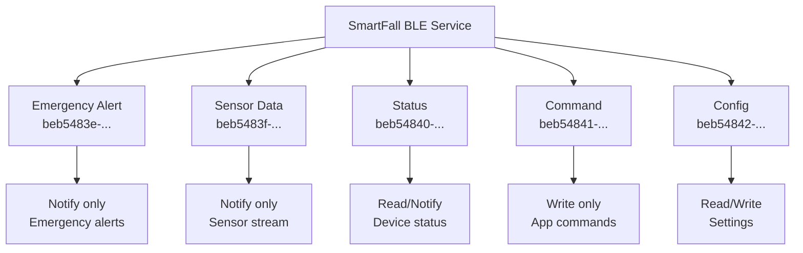

# BLE Protocol Specification

Bluetooth Low Energy protocol for SmartFall mobile app communication.

## Service Architecture



## Service UUID

```
4fafc201-1fb5-459e-8fcc-c5c9c331914b
```

## Characteristics Reference

### 1. Emergency Alert Characteristic

```
UUID:        beb5483e-36e1-4688-b7f5-ea07361b26a8
Properties:  Notify only
Descriptor:  Client Characteristic Configuration (CCCD)
Max Length:  512 bytes
```

**Notification Data (JSON):**
```json
{
  "type": "emergency",
  "timestamp": 1234567890000,
  "confidence_score": 85,
  "confidence_level": 4,
  "battery_level": 78.5,
  "sos_triggered": false,
  "device_id": "SF-AABBCCDDEEFF",
  "location": {
    "latitude": 40.7128,
    "longitude": -74.0060
  },
  "message": "Fall detected - Emergency response initiated"
}
```

**Trigger**: Sent when confidence ≥ 76 or SOS button pressed

### 2. Sensor Data Characteristic

```
UUID:        beb5483f-36e1-4688-b7f5-ea07361b26a8
Properties:  Notify only
Descriptor:  Client Characteristic Configuration (CCCD)
Max Length:  128 bytes
Update Rate: 1 per second (when streaming enabled)
```

**Notification Data (JSON):**
```json
{
  "timestamp": 1234567890000,
  "accel": {
    "x": -0.2,
    "y": 0.1,
    "z": -9.5
  },
  "gyro": {
    "x": 120,
    "y": 80,
    "z": -45
  },
  "pressure": 101325,
  "temperature": 21.5,
  "heart_rate": 95,
  "spo2": 98,
  "fsr": 2100,
  "battery": 78.5
}
```

**Control**: Enable/disable via Command characteristic

### 3. Status Characteristic

```
UUID:        beb54840-36e1-4688-b7f5-ea07361b26a8
Properties:  Read, Notify
Descriptor:  Client Characteristic Configuration (CCCD)
Max Length:  256 bytes
```

**Read/Notify Data (JSON):**
```json
{
  "device_name": "SmartFall",
  "device_id": "SF-AABBCCDDEEFF",
  "firmware_version": "1.0.0",
  "system_state": "monitoring",
  "battery_level": 78.5,
  "battery_voltage": 3.85,
  "wifi_connected": true,
  "wifi_signal": -55,
  "ble_connected": true,
  "uptime_seconds": 3600,
  "last_fall_detection": 1234567200000,
  "sensor_status": {
    "mpu6050": "OK",
    "bmp280": "OK",
    "max30102": "OK",
    "fsr": "OK"
  }
}
```

### 4. Command Characteristic

```
UUID:        beb54841-36e1-4688-b7f5-ea07361b26a8
Properties:  Write only
Descriptor:  None
Max Length:  20 bytes (BLE limitation)
```

**Write Commands:**

| Command | Code | Payload | Description |
|---------|------|---------|-------------|
| Cancel Alert | 0x01 | None | Stop active emergency alert |
| Test Alert | 0x02 | Duration (1 byte) | Trigger test siren (1-30s) |
| Get Status | 0x03 | None | Request immediate status |
| Set Config | 0x04 | See below | Modify device settings |
| Start Streaming | 0x05 | Interval (2 bytes) | Enable sensor data stream |
| Stop Streaming | 0x06 | None | Disable sensor stream |

**Command Examples:**

Cancel alert:
```
[0x01]
```

Test alert for 5 seconds:
```
[0x02, 0x05]
```

Start streaming at 500ms interval:
```
[0x05, 0x01, 0xF4]  // 500 in hex: 0x01F4
```

### 5. Config Characteristic

```
UUID:        beb54842-36e1-4688-b7f5-ea07361b26a8
Properties:  Read, Write
Descriptor:  None
Max Length:  20 bytes
```

**Read (Get Configuration):**
```json
{
  "audio_volume": 80,
  "language": "en",
  "alert_delay_seconds": 5,
  "emergency_contacts": [
    "555-0100",
    "555-0101"
  ]
}
```

**Write (Set Configuration):**
```
Format: [param_id, value_type, value_bytes...]

Examples:
[0x01, 0x80]                    // Set volume to 128 (80%)
[0x02, "en"]                    // Set language to English
[0x03, 0x05]                    // Set alert delay to 5 seconds
```

## Connection Sequence

```
Mobile App → SmartFall Device

1. Start BLE scan for "SmartFall"
   ↓
2. Connect to device
   ↓
3. Discover service UUID: 4fafc201-1fb5-459e-8fcc-c5c9c331914b
   ↓
4. Discover characteristics (5 total)
   ↓
5. Subscribe to Emergency Alert (CCCD)
   ↓
6. Subscribe to Status (CCCD)
   ↓
7. Subscribe to Sensor Data (optional, for streaming)
   ↓
8. Receive notifications as events occur
```

## Notification Flow Diagram

```
SmartFall Device                    Mobile App

Fall Detected ────────────────→
   │                                  Display Alert
   │                                  Play Sound
   │                                  Vibrate
   │
   ├─→ Send Emergency Alert (notify)
   │
   ├─→ Await response
   │
   └─→ Every 100ms: Send Status (notify)
                                    ↓
                           User taps "Cancel"
                                    │
                                    ↓
                           Send Command (write)
                                    │
                                    ↓
Device receives cancel command ←────┘
   │
   └─→ Stop siren, reset state
```

## Data Formats

### JSON Serialization

All BLE notifications use UTF-8 encoded JSON strings.

**Size Example:**
- Emergency Alert: ~200-300 bytes
- Status: ~150-200 bytes
- Sensor Data: ~100-150 bytes

### Binary Mode (Future)

Could be optimized to binary format for bandwidth:
```
Emergency: [header(1)] [timestamp(4)] [score(1)] [battery(1)] [sos(1)]
         = 8 bytes vs 200 bytes JSON
```

## MTU and Packet Size

**Default MTU**: 20 bytes

If your central device supports larger MTU (up to 512 bytes):
```cpp
// Device increases MTU
BLEDevice::setMTU(512);

// Central device can request:
ATT_MTU = 517 bytes
```

## Reliability and Retries

- BLE notifications may be lost on interference
- For critical alerts, use both WiFi and BLE
- App should re-request status if notifications stop

## Example Mobile App Code

### iOS/Swift Implementation

```swift
import CoreBluetooth

let smartfallServiceUUID = CBUUID(string: "4fafc201-1fb5-459e-8fcc-c5c9c331914b")
let emergencyCharUUID = CBUUID(string: "beb5483e-36e1-4688-b7f5-ea07361b26a8")
let commandCharUUID = CBUUID(string: "beb54841-36e1-4688-b7f5-ea07361b26a8")

// Start scanning
let centralManager = CBCentralManager()
centralManager.scanForPeripherals(withServices: [smartfallServiceUUID])

// Connect to device
centralManager.connect(peripheral)

// Subscribe to notifications
peripheral.setNotifyValue(true, for: emergencyCharacteristic)

// Receive emergency alert
func peripheral(_ peripheral: CBPeripheral,
                didUpdateValueFor characteristic: CBCharacteristic) {
    if let data = characteristic.value {
        let json = String(data: data, encoding: .utf8)
        let alert = try? JSONDecoder().decode(Emergency.self, from: data)

        // Handle emergency
        showEmergencyAlert(alert!)
        playAlertSound()
        displayCountdown(duration: 30)
    }
}

// Send cancel command
func cancelAlert() {
    let command = Data([0x01])  // Cancel Alert
    peripheral.writeValue(command, for: commandCharacteristic,
                         type: .withoutResponse)
}
```

### Android/Kotlin Implementation

```kotlin
val SMARTFALL_SERVICE_UUID = UUID.fromString(
    "4fafc201-1fb5-459e-8fcc-c5c9c331914b"
)
val EMERGENCY_CHARACTERISTIC_UUID = UUID.fromString(
    "beb5483e-36e1-4688-b7f5-ea07361b26a8"
)

// Scan for devices
val scanner = bluetoothAdapter?.bluetoothLeScanner
scanner?.startScan(mScanCallback)

// Connect
gatt = device.connectGatt(this, false, gattCallback)

// Subscribe to notifications
fun enableNotifications(characteristic: BluetoothGattCharacteristic) {
    gatt?.setCharacteristicNotification(characteristic, true)

    val descriptor = characteristic.getDescriptor(
        UUID.fromString("00002902-0000-1000-8000-00805f9b34fb")
    )
    descriptor.value = BluetoothGattDescriptor.ENABLE_NOTIFICATION_VALUE
    gatt?.writeDescriptor(descriptor)
}

// Receive notifications
override fun onCharacteristicChanged(
    gatt: BluetoothGatt,
    characteristic: BluetoothGattCharacteristic
) {
    val json = String(characteristic.value!!)
    val alert = Json.decodeFromString<EmergencyAlert>(json)

    // Handle emergency
    showEmergencyUI(alert)
}

// Send command
fun sendCommand(commandByte: Byte) {
    val command = byteArrayOf(commandByte)
    commandCharacteristic?.value = command
    gatt?.writeCharacteristic(commandCharacteristic)
}
```

## Testing

Use a BLE scanner app to test:
- **iOS**: LightBlue, BLE Scanner
- **Android**: nRF Connect, BLE Scanner

1. Scan and connect to "SmartFall"
2. View all characteristics
3. Subscribe to notifications
4. Trigger fall simulation
5. Observe Emergency Alert notification

## Next Steps

1. **WiFi Endpoints**: See [WiFi API](wifi-endpoints.md)
2. **Testing**: See [Component Tests](../testing/component-tests.md)
3. **Troubleshooting**: See [Troubleshooting Guide](../troubleshooting.md)
