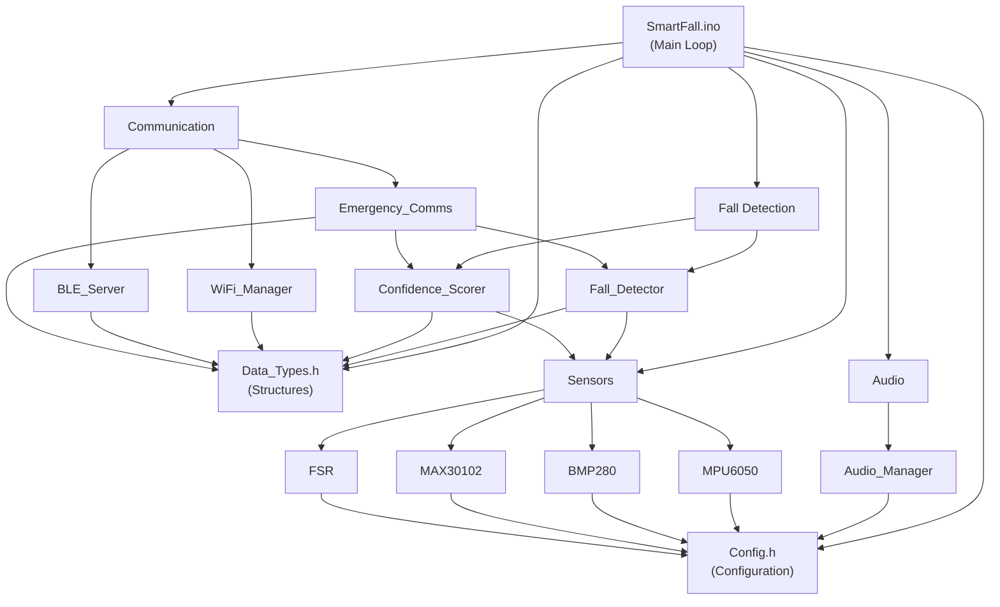

# Firmware Architecture

Comprehensive overview of the SmartFall firmware structure, modules, and dependencies.

## Project Directory Structure

```
SmartFall/
├── SmartFall.ino                 # Main sketch (entry point)
├── sketch.yaml                   # Arduino CLI configuration
│
├── Config.h                      # All system configuration
├── Data_Types.h                  # Shared data structures
│
├── Sensors/
│   ├── MPU6050.h/cpp            # 6-axis IMU driver
│   ├── BMP280.h/cpp             # Pressure sensor driver
│   ├── MAX30102_Sensor.h/cpp     # Heart rate sensor driver
│   └── FSR.h/cpp                # Force sensor driver
│
├── Detection/
│   ├── Fall_Detector.h/cpp       # 5-stage fall detection algorithm
│   └── Confidence_Scorer.h/cpp   # Confidence scoring system
│
├── Communication/
│   ├── WiFi_Manager.h/cpp        # WiFi connectivity & HTTP
│   ├── BLE_Server.h/cpp          # Bluetooth Low Energy server
│   └── Emergency_Comms.h/cpp     # Alert transmission logic
│
├── Audio/
│   └── Audio_Manager.h/cpp       # PAM8302 audio output system
│
└── Tests/                        # Component test sketches
    ├── MPU6050/
    ├── BMP280/
    ├── MAX30102/
    ├── FSR/
    ├── WiFi/
    ├── BLE/
    └── Audio/
```

## Module Dependency Diagram



## Main Loop Flow

The `SmartFall.ino` main sketch follows this execution pattern:

```
┌─────────────────────────────────────┐
│         System Startup              │
│  - Initialize sensors               │
│  - Configure GPIO pins              │
│  - Start WiFi/BLE                   │
│  - Print startup banner             │
└────────────┬────────────────────────┘
             │
             ↓
┌─────────────────────────────────────┐
│      Main Loop (10ms, 100Hz)        │
├─────────────────────────────────────┤
│  1. Read all sensor data            │
│  2. Pass to Fall_Detector           │
│  3. Check SOS button                │
│  4. Process emergency alert         │
│  5. Update WiFi/BLE status          │
│  6. Transmit alert if needed        │
│  7. Update UI (LED/audio)           │
│  8. Sleep for remaining time        │
└────────────┬────────────────────────┘
             │
             └─── Loop every 10ms ───┘
```

## Core Data Structures

### SensorData_t

```cpp
struct SensorData_t {
    // Timestamp
    uint32_t timestamp_ms;

    // Accelerometer (m/s²)
    float accel_x, accel_y, accel_z;

    // Gyroscope (°/s)
    float gyro_x, gyro_y, gyro_z;

    // Pressure sensor
    float pressure_pa;
    float altitude_m;
    float temperature_c;

    // Heart rate
    uint16_t heart_rate;        // BPM
    uint8_t spo2;               // Blood oxygen %
    float heart_rate_temperature; // °C

    // Force sensor
    uint16_t fsr_value;         // 0-4095 ADC
    float device_pressure;      // Estimated Pa

    // Battery
    float battery_voltage;      // Volts
    uint8_t battery_percent;    // 0-100%
};
```

### FallStatus_t

```cpp
enum FallStatus_t {
    NO_FALL_DETECTED = 0,
    SUSPICIOUS_ACTIVITY = 1,
    POTENTIAL_FALL = 2,
    CONFIRMED_FALL = 3,
    HIGH_CONFIDENCE_FALL = 4,
    SOS_TRIGGERED = 5
};
```

## Module Responsibilities

### Configuration (`Config.h`)

Central repository for all configurable parameters:
- Pin definitions (I2C, analog, digital)
- Threshold values (acceleration, rotation, confidence)
- WiFi/BLE credentials
- Timing constants
- Audio settings
- Debug flags

### Sensors Module

**Individual drivers:**

| Driver | Responsibility |
|--------|-----------------|
| **MPU6050** | Read 6-axis IMU data @ 100Hz |
| **BMP280** | Read pressure & temperature |
| **MAX30102** | Read heart rate & SpO2 |
| **FSR** | Read analog force sensor |

**Interface:**
```cpp
bool init();              // Initialize sensor
bool readData(sensor_data);  // Get latest reading
bool isAvailable();       // Check if responding
```

### Fall Detection Pipeline

**Flow:**
```
Raw Sensor Data
    ↓
┌─────────────────────────────┐
│     Fall_Detector           │
│  • 5-stage analysis         │
│  • Timing validation        │
│  • History tracking         │
└─────────┬───────────────────┘
          ↓
┌─────────────────────────────┐
│  Confidence_Scorer          │
│  • Calculate points         │
│  • Apply thresholds         │
│  • Return FallStatus_t      │
└─────────┬───────────────────┘
          ↓
      FallStatus_t
```

### Communication System

**Architecture:**
```
Emergency Alert
    ├─→ WiFi_Manager
    │   └─→ HTTP POST /api/emergency
    │
    └─→ BLE_Server
        └─→ Notify Emergency characteristic
```

**Features:**
- Automatic retry on failure
- Dual-protocol redundancy
- Offline queueing (experimental)

### Audio System

**Capabilities:**
- Pre-defined alert patterns
- Voice-like tone sequences
- Volume control (0-100%)
- PWM synthesis at 5 kHz

## Key Design Principles

### 1. Modularity

Each component (sensors, detection, communication) is independent with clear interfaces.

**Benefit**: Easy testing, replacement, and parallel development

### 2. Memory Efficiency

- Circular buffers for sensor history
- No dynamic allocation in core loops
- Fixed-size arrays matching ESP32 constraints

**Benefit**: Predictable memory usage, no fragmentation

### 3. Real-Time Processing

- 100Hz sampling rate
- Non-blocking main loop
- Hardware interrupts for SOS button

**Benefit**: Sub-2-second response time to falls

### 4. Configurability

All thresholds in `Config.h` without recompilation.

**Benefit**: Quick tuning for different user profiles

## Build Configuration

### Arduino CLI

```bash
cd SmartFall
arduino-cli compile --fqbn esp32:esp32:adafruit_feather_esp32_v2 .
```

### PlatformIO

```bash
pio run -e feather_esp32_v2 -t build
```

### Arduino IDE

File → Open → SmartFall.ino, then Sketch → Verify

## Memory Usage

### Flash Memory

```
Firmware binary:        ~600 KB
Partition table:        ~10 KB
Reserved SPIFFS:        ~1.4 MB
─────────────────────
Total 8MB Flash
```

### RAM Usage

```
Static data:            ~80 KB
Sensor history buffer:  ~10 KB (100 samples × 100 bytes)
Stack:                  ~20 KB
Free heap:              ~400+ KB (available for runtime)
```

## Performance Characteristics

| Metric | Value | Notes |
|--------|-------|-------|
| **Sensor Sample Rate** | 100 Hz | 10ms intervals |
| **Fall Detection Time** | <2 seconds | From event to alert |
| **Alert Transmission** | <1 second | WiFi POST request |
| **CPU Utilization** | <5% | Dual-core 240MHz |
| **Loop Jitter** | ±1ms | Acceptable for fall detection |

## Next Steps

1. **Sensor Details**: See [Sensors](sensors.md)
2. **Detection Logic**: See [Fall Detection](fall-detection.md)
3. **Communication**: See [Communication](communication.md)
4. **Audio**: See [Audio System](audio.md)
5. **Configuration**: See [Config Reference](../configuration/config-reference.md)
