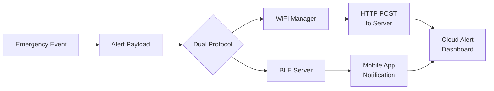
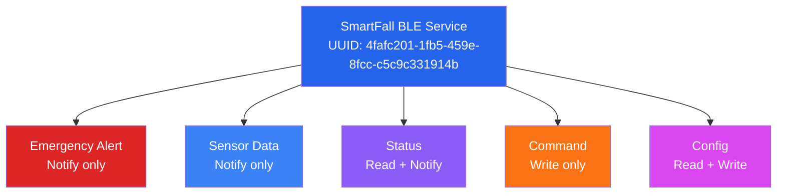
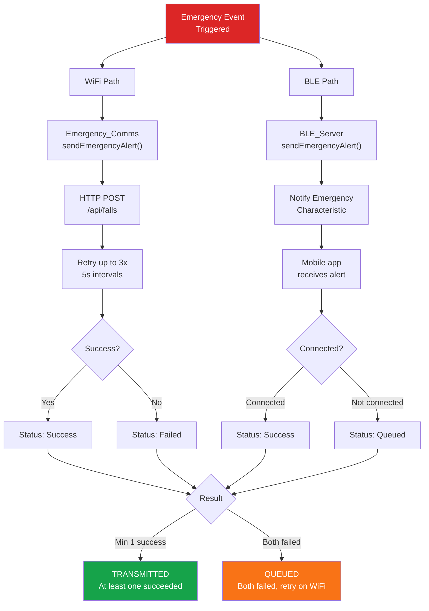

# Communication System

WiFi and Bluetooth Low Energy integration for emergency alerts and status updates.

## Architecture Overview



## WiFi Communication

### WiFiManager Class

Handles WiFi connectivity and HTTP emergency alert transmission.

#### Initialization

```cpp
#include "WiFi_Manager.h"

WiFiManager wifi_manager;

// Configure WiFi credentials
wifi_manager.setSSID("YourNetworkName");
wifi_manager.setPassword("YourPassword");

// Initialize
bool success = wifi_manager.begin();

if (success) {
    Serial.println("WiFi connected");
} else {
    Serial.println("WiFi connection failed");
}
```

#### Configuration (Config.h)

```cpp
#define WIFI_SSID                 "YourNetworkName"
#define WIFI_PASSWORD             "YourPassword"
#define WIFI_TIMEOUT_MS           30000     // 30 second connection timeout
#define WIFI_RECONNECT_INTERVAL_MS 30000    // Try reconnect every 30s
#define WIFI_MAX_RECONNECT_ATTEMPTS 5

// Both http:// and https:// are supported — firmware auto-selects client
#define SERVER_URL                "http://your-server.com"
#define SERVER_PORT               80

#define EMERGENCY_MAX_RETRIES     3
#define EMERGENCY_RETRY_INTERVAL_MS 5000
```

#### Emergency Alert Transmission

```cpp
// Populated by fall detection pipeline
EmergencyData_t emergency;
emergency.confidence_score = confidenceScorer.getTotalScore();   // 0-100
emergency.confidence          = confidenceScorer.getConfidenceLevel(); // enum
emergency.battery_level       = getBatteryPercentage();
emergency.sos_triggered       = (digitalRead(SOS_BUTTON_PIN) == LOW);
strncpy(emergency.device_id, deviceID, sizeof(emergency.device_id));

// Emergency_Comms maps enum → "HIGH" / "CONFIRMED" etc. and POSTs to /api/falls
bool success = emergencyComms.sendEmergencyAlert(emergency);

if (!success) {
    Serial.println("Emergency transmission failed, retrying...");
    // Automatic retry logic in Emergency_Comms
}
```

#### Connection Management

```cpp
// Check WiFi status
if (wifi_manager.isConnected()) {
    Serial.println("Connected to WiFi");
} else {
    Serial.println("WiFi disconnected");
}

// Get signal strength
int8_t rssi = wifi_manager.getSignalStrength();  // dBm
// -30 to -90 dBm (higher is better)

// Reconnect manually
wifi_manager.reconnect();

// Disconnect
wifi_manager.disconnect();
```

### HTTP Endpoints

Three separate endpoints receive data from the device. All timestamps are generated
server-side — no timestamp field is sent from the hardware.

#### POST /api/falls

Fall alert payload:

```
POST /api/falls HTTP/1.1
Host: your-server.com
Content-Type: application/json
```

```json
{
  "device_id":        "SF-AABBCCDDEEFF",
  "confidence_score": 85,
  "confidence_level": "HIGH",
  "sos_triggered":    false,
  "battery_level":    78.5
}
```

`confidence_level` is a string: `NO_FALL`, `SUSPICIOUS`, `POTENTIAL`, `HIGH`, or `CONFIRMED`.

**Response:**
```json
{ "success": true }
```

#### POST /api/device/status

Periodic heartbeat (every 60 seconds):

```json
{
  "device_id":     "SF-AABBCCDDEEFF",
  "battery_level": 78.5,
  "system_health": true,
  "uptime":        123456
}
```

#### POST /api/device/sensor-stream

Sensor readings sent every 5 seconds:

```json
{
  "device_id":  "SF-AABBCCDDEEFF",
  "accel_x":    -0.02,
  "accel_y":     0.01,
  "accel_z":     1.00,
  "gyro_x":      1.20,
  "gyro_y":     -0.50,
  "gyro_z":      0.80,
  "pressure":    101325.00,
  "heart_rate":  72,
  "spo2":        98
}
```

Unknown devices are auto-registered on first sensor-stream POST.

## Bluetooth Low Energy (BLE)

### BLE Server Architecture



### SmartFallBLEServer Class

```cpp
#include "BLE_Server.h"

SmartFallBLEServer ble_server;

// Initialize with device name
bool success = ble_server.begin("SmartFall");

// Register callbacks
ble_server.onConnect([]() {
    Serial.println("BLE: Device connected");
});

ble_server.onDisconnect([]() {
    Serial.println("BLE: Device disconnected");
});

ble_server.onCommand([](uint8_t cmd, uint8_t *data, size_t len) {
    Serial.print("BLE Command received: 0x");
    Serial.println(cmd, HEX);
});
```

### BLE Characteristics

| Name | UUID | Properties | Purpose |
|------|------|-----------|---------|
| **Emergency Alert** | beb5483e-... | Notify | Emergency notifications |
| **Sensor Data** | beb5483f-... | Notify | Real-time sensor streaming |
| **Status** | beb54840-... | Read, Notify | Device status |
| **Command** | beb54841-... | Write | App commands to device |
| **Config** | beb54842-... | Read, Write | Settings configuration |

### Sending BLE Notifications

```cpp
// Send emergency alert
EmergencyData_t emergency;
// ... populate emergency data ...
ble_server.sendEmergencyAlert(emergency);

// Send sensor data
SensorData_t sensor_data;
// ... populate sensor data ...
ble_server.sendSensorData(sensor_data);

// Send status update
SystemStatus_t status;
status.battery_level = 75;
status.connection_state = CONNECTED;
ble_server.sendStatusUpdate(status);
```

### BLE Commands

Mobile apps send commands via the Command characteristic:

| Command | Code | Payload | Purpose |
|---------|------|---------|---------|
| Cancel Alert | 0x01 | None | Stop active alert |
| Test Alert | 0x02 | Duration (1 byte) | Test alert system |
| Get Status | 0x03 | None | Request full status |
| Set Config | 0x04 | See below | Update settings |
| Start Streaming | 0x05 | Interval (2 bytes) | Enable sensor stream |
| Stop Streaming | 0x06 | None | Disable sensor stream |

### Streaming Mode

Enable real-time sensor data streaming to mobile app:

```cpp
// Enable streaming
ble_server.enableStreaming(true);
ble_server.setStreamingInterval(1000);  // 1 second updates

// Check if should stream now
if (ble_server.shouldStream()) {
    ble_server.sendSensorData(current_sensor_data);
}

// Disable streaming
ble_server.enableStreaming(false);
```

### Connection Management

```cpp
// Check connection status
if (ble_server.isConnected()) {
    Serial.println("BLE client connected");

    // Send notifications
    ble_server.sendStatusUpdate(status);
} else {
    Serial.println("No BLE client connected");
}

// Start/stop advertising
ble_server.startAdvertising();
// ...
ble_server.stopAdvertising();

// Get device name
String name = ble_server.getDeviceName();
```

## Emergency Communications Class

Coordinates WiFi and BLE transmission:

```cpp
#include "Emergency_Comms.h"

EmergencyComms emergency_comms;

// Initialize both communication systems
emergency_comms.begin();

// Send alert via both protocols
EmergencyData_t alert;
// ... populate alert data ...
emergency_comms.sendAlert(alert);

// Automatic retry logic:
// 1. Send to WiFi
// 2. If WiFi fails, retry 3 times
// 3. Send to BLE (if connected)
// 4. Queue for retry if both fail

// Check transmission status
EmergencyComms::Status status = emergency_comms.getLastStatus();
if (status == EmergencyComms::TRANSMISSION_SUCCESS) {
    Serial.println("Alert sent successfully");
} else if (status == EmergencyComms::TRANSMISSION_PENDING) {
    Serial.println("Alert queued for retry");
} else {
    Serial.println("Alert transmission failed");
}
```

## Dual-Protocol Alert Flow



## Power Consumption During Communication

| Operation | Power Draw | Duration |
|-----------|-----------|----------|
| WiFi scan | 80 mA | 1-2 seconds |
| WiFi connect | 80 mA | 5-10 seconds |
| HTTP POST | 80 mA | 1-3 seconds |
| BLE advertise | 10-20 mA | Continuous |
| BLE notify | 30-50 mA | <100ms |

## Testing Communication

### WiFi Testing

```cpp
// In test sketch
#include "WiFi_Manager.h"

WiFiManager wifi;
wifi.setSSID("YourSSID");
wifi.setPassword("YourPassword");

if (wifi.begin()) {
    Serial.println("✓ WiFi connected");

    // Test HTTP request
    EmergencyData_t test_alert;
    test_alert.timestamp = millis();
    test_alert.confidence_score = 50;

    if (wifi.sendEmergency(test_alert)) {
        Serial.println("✓ Emergency transmission succeeded");
    } else {
        Serial.println("✗ Emergency transmission failed");
    }
} else {
    Serial.println("✗ WiFi connection failed");
}
```

### BLE Testing

Use a mobile BLE scanner app:
- **iOS**: LightBlue, BLE Scanner
- **Android**: nRF Connect, BLE Scanner

1. Scan for "SmartFall" device
2. Connect to service `4fafc201-1fb5-459e-8fcc-c5c9c331914b`
3. Subscribe to Emergency Alert characteristic
4. Trigger test alert

## Next Steps

1. **API Reference**: See [WiFi Endpoints](../api/wifi-endpoints.md) and [BLE Protocol](../api/ble-protocol.md)
2. **Audio Alerts**: See [Audio System](audio.md)
3. **Testing**: See [Component Tests](../testing/component-tests.md)
4. **Configuration**: See [Config Reference](../configuration/config-reference.md)
