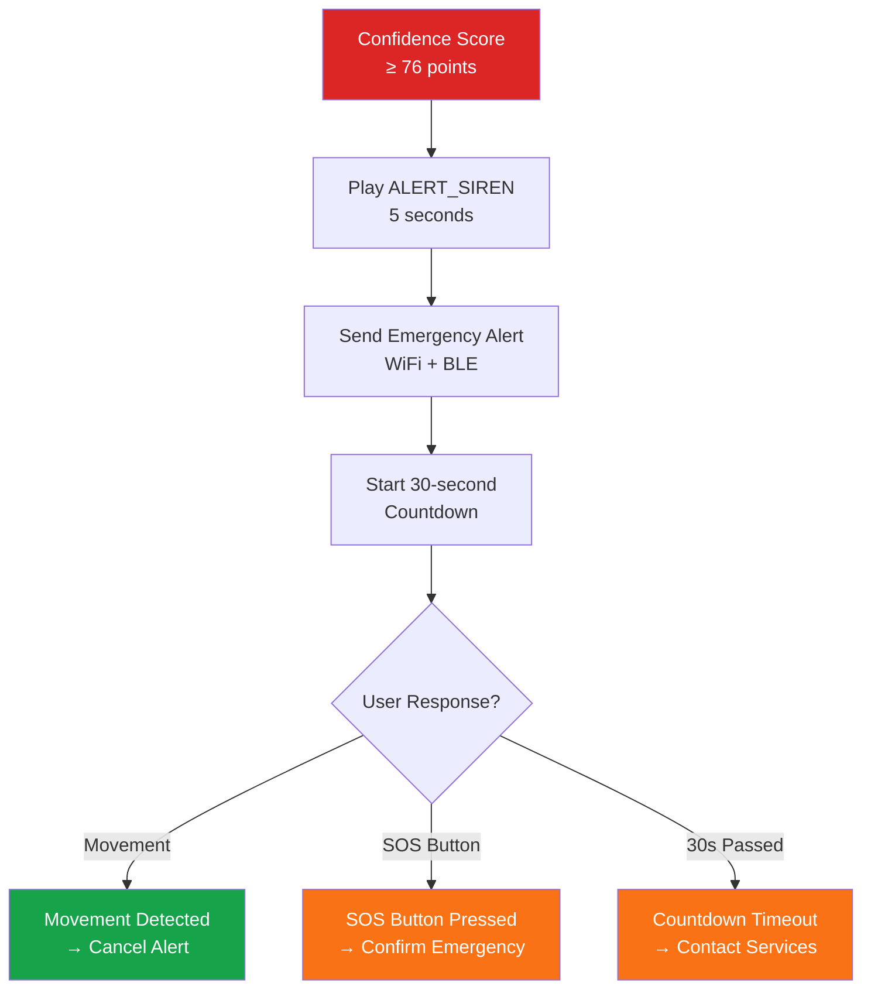
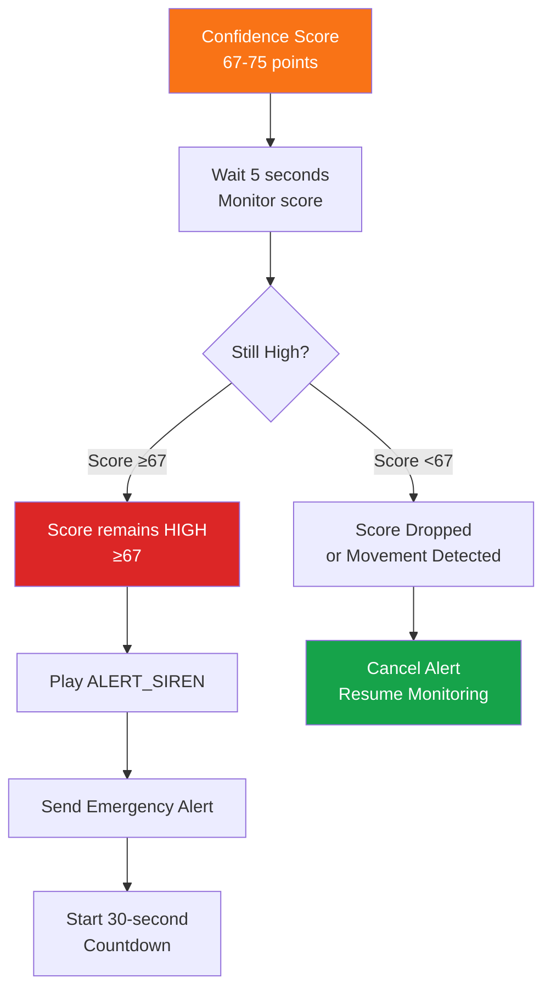
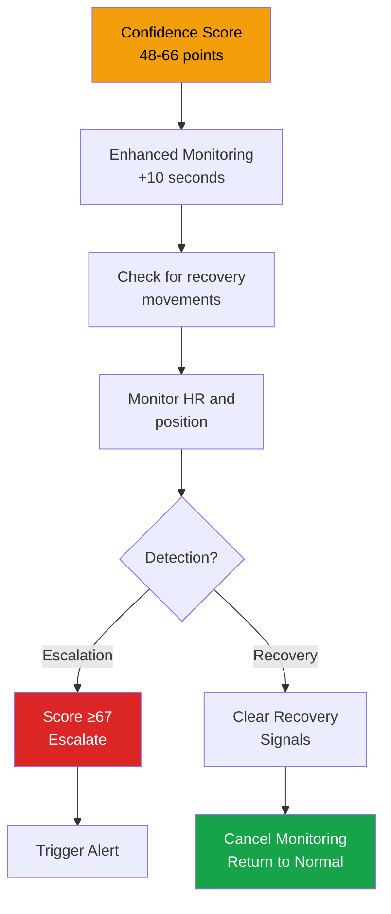

# Fall Detection Implementation

API documentation for the FallDetector and ConfidenceScorer classes.

## FallDetector Class

Main fall detection engine processing sensor data through 5-stage analysis.

### Initialization

```cpp
#include "Fall_Detector.h"

FallDetector fall_detector;

// Initialize detector
bool success = fall_detector.init();

// Enable monitoring
fall_detector.enableMonitoring();
```

### Processing Sensor Data

```cpp
// In main loop (10ms interval)
SensorData_t sensor_data;
// ... populate sensor_data from sensors ...

// Process through detection pipeline
fall_detector.processSensorData(sensor_data);

// Get current status
FallStatus_t status = fall_detector.getCurrentStatus();

// Handle alert if status changed
if (status == HIGH_CONFIDENCE_FALL) {
    emergency_comms.sendAlert(sensor_data, status);
    audio_manager.playAlert(ALERT_SIREN);
}
```

### FallStatus Values

```cpp
enum FallStatus_t {
    NO_FALL_DETECTED = 0,       // Normal monitoring
    SUSPICIOUS_ACTIVITY = 1,    // Score 30-48
    POTENTIAL_FALL = 2,         // Score 48-67
    CONFIRMED_FALL = 3,         // Score 67-76
    HIGH_CONFIDENCE_FALL = 4,   // Score ≥76
    SOS_TRIGGERED = 5           // Manual emergency button
};
```

### Core API Methods

#### Status Monitoring

```cpp
// Get current fall status
FallStatus_t status = fall_detector.getCurrentStatus();

// Check if monitoring is active
bool monitoring = fall_detector.isMonitoring();

// Print detailed status to serial
fall_detector.printStatus();
fall_detector.printStageDetails();
```

#### Data Access

```cpp
// Get sensor history (100 samples max)
SensorData_t *history = fall_detector.getSensorHistory();
uint8_t count = fall_detector.getHistoryCount();

// Get stage-specific data
float freefall_duration = fall_detector.getFreefallDuration();
float max_impact = fall_detector.getMaxImpact();
float max_rotation = fall_detector.getMaxRotation();

// Convert status to string for display
const char *status_str = fall_detector.getStatusString(HIGH_CONFIDENCE_FALL);
// Returns: "HIGH_CONFIDENCE_FALL"
```

#### Reset & Control

```cpp
// Reset detection state between events
fall_detector.resetDetection();

// Pause monitoring temporarily
fall_detector.disableMonitoring();

// Resume monitoring
fall_detector.enableMonitoring();
```

#### Threshold Configuration

```cpp
// Get current thresholds
DetectionThresholds_t thresholds = fall_detector.getThresholds();

// Modify thresholds for different users
DetectionThresholds_t new_thresholds = thresholds;
new_thresholds.freefall_threshold = 0.4f;  // Sensitivity adjustment
fall_detector.setThresholds(new_thresholds);
```

## Detection Stages

### Stage 1: Free Fall Detection

**Trigger**: Total acceleration < 0.5g for ≥200ms

```
Maximum 25 points:
  Duration < 200ms:        5 pts
  Duration 200-500ms:     10 pts
  Duration > 500ms:       15 pts

  Magnitude 0.3-0.5g:      5 pts
  Magnitude 0.1-0.3g:      8 pts
  Magnitude < 0.1g:       10 pts
```

### Stage 2: Impact Detection

**Trigger**: Peak acceleration > 3.0g within 1 second of Stage 1

```
Maximum 25 points:
  Impact 3.0-4.0g:         8 pts
  Impact 4.0-6.0g:        12 pts
  Impact > 6.0g:          15 pts

  FSR impact confirmation: 7 pts
  Timing within 0.5s:      5 pts
  Timing within 1.0s:      3 pts
```

### Stage 3: Rotation Assessment

**Trigger**: Angular velocity > 150°/s during Stages 1-2

```
Maximum 20 points:
  Rotation 150-400°/s:     8 pts
  Rotation 400-600°/s:    12 pts
  Rotation > 600°/s:      15 pts

  Orientation change 45-90°:  3 pts
  Orientation change > 90°:   5 pts
```

!!! warning "Threshold Note"
    Config.h uses `ROTATION_THRESHOLD_DPS = 150.0f` which differs from the specification (250°/s). Use the code value (150) as authoritative.

### Stage 4: Inactivity Assessment

**Trigger**: Acceleration 0.8-1.2g + Angular velocity <50°/s for ≥2 seconds

```
Maximum 20 points:
  Inactivity 2-5 sec:      8 pts
  Inactivity 5-10 sec:    12 pts
  Inactivity > 10 sec:    15 pts

  Minimal micro-movements:  5 pts
```

### Stage 5: False Positive Filters

**Applied after all stages, maximum 15 points:**

#### Filter A: Pressure Change
```
0.5-1.0m altitude change:   2 pts
1.0-2.0m altitude change:   3 pts
> 2.0m altitude change:     5 pts
```

#### Filter B: Heart Rate Response
```
HR increase > 40 BPM:       8 pts
HR increase 20-40 BPM:      5 pts
Normal SpO2 (≥90%):         5 pts
Low SpO2 (85-90%):          2 pts
```

#### Filter C: Device Attachment
```
Consistent strap tension:    2 pts
Pressure spike at impact:    3 pts
```

## Confidence Scoring System

The `ConfidenceScorer` class calculates total confidence:

```cpp
#include "Confidence_Scorer.h"

ConfidenceScorer scorer;

// Initialize
scorer.init();

// Add points from detection stages
scorer.addFreeFallScore(15);      // Max 25
scorer.addImpactScore(20);        // Max 25
scorer.addRotationScore(15);      // Max 20
scorer.addInactivityScore(18);    // Max 20
scorer.addFilterScore(12);        // Max 15
                                  // ─────────
                                  // Total: 80

// Get final confidence
uint8_t confidence = scorer.getConfidenceScore();
FallStatus_t status = scorer.classifyFall();

// Get detailed breakdown
uint8_t stage1 = scorer.getStage1Score();  // 15
uint8_t stage2 = scorer.getStage2Score();  // 20
// etc.
```

### Threshold Decision Matrix

```cpp
const uint8_t HIGH_CONFIDENCE_THRESHOLD = 76;   // ≥76: HIGH (immediate alert)
const uint8_t CONFIRMED_THRESHOLD = 67;         // 67-75: CONFIRMED (5s delay)
const uint8_t POTENTIAL_THRESHOLD = 48;         // 48-66: POTENTIAL (monitor)
const uint8_t SUSPICIOUS_THRESHOLD = 29;        // 30-47: SUSPICIOUS (normal)
                                                 // <29: NO FALL
```

## Alert Logic

### Immediate Action (≥76 points)



### Confirmed Fall (67-75 points)



### Potential Fall (48-66 points)



## Sensor History

Fall detector maintains a sliding window of recent data:

```cpp
// Get full history
SensorData_t *history = fall_detector.getSensorHistory();
uint8_t count = fall_detector.getHistoryCount();

// Process history
for (uint8_t i = 0; i < count; i++) {
    SensorData_t &sample = history[i];
    float accel = sqrt(sample.accel_x*sample.accel_x +
                       sample.accel_y*sample.accel_y +
                       sample.accel_z*sample.accel_z);
    Serial.print("Sample ");
    Serial.print(i);
    Serial.print(": ");
    Serial.print(accel);
    Serial.println("g");
}
```

!!! info "History Buffer"
    - **Size**: 100 samples (10 seconds at 100Hz)
    - **Resolution**: ~100 bytes per sample
    - **Total Memory**: ~10 KB
    - **Purpose**: Replay detection window for debugging

## Debug Output

Enable serial debug output for algorithm analysis:

```cpp
// In Config.h
#define DEBUG_ALGORITHM_STEPS true

// Output example:
// Stage 1 triggered: 15 pts (duration: 350ms, min accel: 0.15g)
// Stage 2 triggered: 20 pts (impact: 4.5g, timing: 0.3s)
// Stage 3 triggered: 15 pts (rotation: 380°/s, change: 85°)
// Stage 4 triggered: 18 pts (inactivity: 2.5s)
// Filter Score: 12 pts (HR spike: +8, Pressure: +4)
// ─────────────────────────
// TOTAL CONFIDENCE: 80 pts → HIGH_CONFIDENCE_FALL
```

## Integration with Emergency System

```cpp
// When fall detected
if (fall_detector.getCurrentStatus() >= CONFIRMED_FALL) {
    // Create emergency payload
    EmergencyData_t alert;
    alert.confidence_score = fall_detector.getCurrentStatus();
    alert.timestamp = millis();

    // Include sensor history
    SensorData_t *history = fall_detector.getSensorHistory();
    alert.sensor_count = fall_detector.getHistoryCount();

    // Send alert
    emergency_comms.sendAlert(alert);

    // Reset for next detection
    fall_detector.resetDetection();
}
```

## Next Steps

1. **Confidence Scoring Details**: See [Confidence Scoring](../algorithm/confidence-scoring.md)
2. **Communication**: See [Communication System](communication.md)
3. **Testing**: See [Fall Simulation Tests](../testing/fall-simulation.md)
4. **Configuration**: See [Config Reference](../configuration/config-reference.md)
