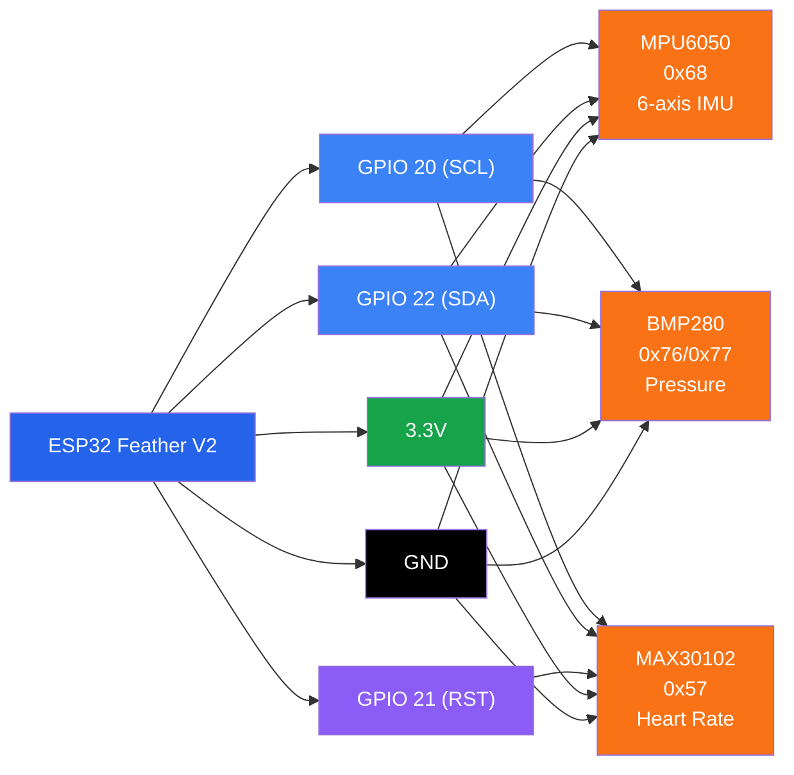
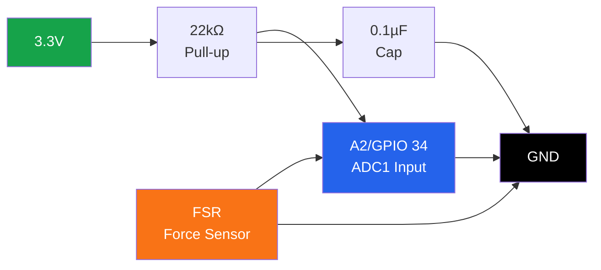
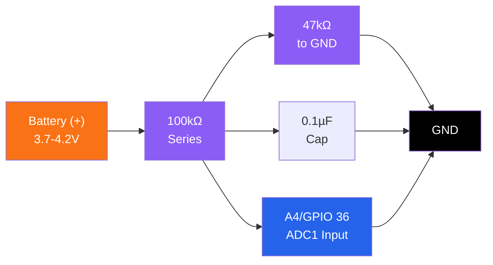

# Wiring Guide

Complete wiring diagram and connection specifications for SmartFall hardware.

!!! warning "ADC Safety Warning"

    **ADC2 pins (GPIO 0, 2, 4, 12–15, 25–27) are unusable with WiFi active on the ESP32.** SmartFall uses only **ADC1 pins** (GPIO 34, 36) for FSR and battery monitoring to maintain WiFi functionality. Do not connect analog sensors to ADC2 pins when WiFi is enabled.

## I2C Sensors (Shared Bus)

All I2C devices connect to the same **SDA/SCL** pins on the ESP32 Feather V2:

### I2C Configuration

| Parameter | Value |
|-----------|-------|
| **SCL Pin** | GPIO 20 |
| **SDA Pin** | GPIO 22 |
| **Speed** | 100 kHz (standard mode) |
| **Voltage** | 3.3V |

### Sensor Connections



### Sensor Details

| Sensor | I2C Address | Connection | Notes |
|--------|-------------|-----------|-------|
| **MPU6050** | 0x68 | GPIO 20, 22, 3V, GND | Primary IMU sensor |
| **BMP280** | 0x76 or 0x77 | GPIO 20, 22, 3V, GND | Pressure + temperature |
| **MAX30102** | 0x57 | GPIO 20, 22, GPIO 21, 3V, GND | Heart rate sensor, RST on GPIO 21 |

## Analog Sensors (ADC1 - WiFi Safe)

Only use **ADC1 pins** for analog inputs when WiFi is active:

| Sensor | Pin | GPIO | Type | Function |
|--------|-----|------|------|----------|
| **FSR** | A2 | GPIO 34 | Analog Input | Force/Impact detection |
| **Battery Monitor** | A4 | GPIO 36 | Analog Input | Battery voltage (voltage divider) |

### FSR Conditioning Circuit

Each FSR requires proper conditioning:



**Component Values:**
- Pull-up: 22 kΩ resistor to 3.3V
- Noise filter: 0.1 µF capacitor to GND

### Battery Monitor Circuit



**Voltage Divider Ratio:** (100k + 47k) / 47k = 3.128x
- Battery 4.2V → ADC 1.34V
- Battery 3.7V → ADC 1.18V

!!! tip "Battery Voltage Formula"
    Actual battery voltage = ADC_reading × (6.6 / 4095)

    This accounts for the voltage divider (100k+50k/50k) that reduces 4.2V LiPo to 1.4V ADC input.

## Digital I/O

| Component | GPIO | Mode | Function |
|-----------|------|------|----------|
| **SOS Button** | GPIO 15 | INPUT_PULLUP | Emergency override (active LOW) |
| **Speaker/Audio** | GPIO 25 | PWM Output | Audio signal to PAM8302 |
| **Haptic Motor** | GPIO 26 | Digital Output | Vibration feedback (optional) |
| **Visual LED** | GPIO 27 | Digital Output | Status indicator (optional) |

### SOS Button Wiring

```
3.3V (internal pull-up)
  ↑
  │
GPIO 15 ──[Push Button]──── GND
```

No external resistor needed - ESP32 has internal 100kΩ pull-up on GPIO 15.

### Speaker/PAM8302 Audio Amplifier

```
ESP32           PAM8302 Amplifier         Speaker
GPIO 25 (PWM) ─ A+ (Audio In+)
GND ──────────┬─ A- (Audio In-)
              │
              ├─ GND (Ground)
3.3V ─────────┬─ VDD (Power)
              │
              ├─ OUT+ ────────────────── Speaker(+) / OUT+
              └─ OUT- ────────────────── Speaker(-) / OUT- / GND
```

!!! tip "Speaker Selection"
    - **8Ω 0.5W**: Clear audio, lowest power
    - **8Ω 1W**: Balanced volume and power
    - **4Ω 3W**: Maximum loudness, higher current draw (~500mA)

## Complete Pin Assignment Table

| Function | GPIO | Feather V2 Pin | Type | Notes |
|----------|------|----------------|------|-------|
| I2C Clock | 20 | SCL | Digital | Shared I2C bus |
| I2C Data | 22 | SDA | Digital | Shared I2C bus |
| MAX30102 Reset | 21 | MI | Digital | Hardware reset, active LOW |
| FSR Analog | 34 | A2 | Analog (ADC1) | Force sensor |
| Battery Monitor | 36 | A4 | Analog (ADC1) | Voltage divider input |
| SOS Button | 15 | - | Digital Input | Internal pull-up |
| Speaker Output | 25 | - | PWM Output | 5 kHz, 8-bit |
| Haptic Motor | 26 | - | Digital Output | Optional |
| Visual LED | 27 | - | Digital Output | Optional |

## Power Distribution

```
LiPo Battery (3.7V)
       │
       ├─── USB-C Charging Circuit ──→ Battery Manager
       │
       └────┬──────────────────────→ ESP32 VBAT
            │
            ├─→ 3.3V Regulator ──→ 3.3V Rail
            │
            └─→ USB Power (5V)


3.3V Rail Distribution:
    ├─→ MPU6050
    ├─→ BMP280
    ├─→ MAX30102
    ├─→ FSR Pull-up (22k)
    ├─→ Battery Divider (100k)
    └─→ PAM8302 Amplifier

GND Rail (Common):
    ├─→ All sensors
    ├─→ FSR capacitor
    ├─→ Battery divider
    ├─→ PAM8302 and speaker
    ├─→ SOS button
    └─→ LED/Haptic grounds
```

## Connection Checklist

### I2C Sensors
- [ ] GPIO 20 connected to all sensor SCL pins
- [ ] GPIO 22 connected to all sensor SDA pins
- [ ] GPIO 21 connected to MAX30102 RST pin
- [ ] 3.3V power to all sensors
- [ ] GND to all sensors

### Analog Sensors
- [ ] FSR with 22kΩ pull-up and 0.1µF capacitor
- [ ] Battery divider connected to A4 (GPIO 36)
- [ ] 0.1µF capacitor on battery divider input

### Digital I/O
- [ ] SOS button on GPIO 15 (internal pull-up)
- [ ] Speaker GPIO 25 to PAM8302 A+
- [ ] PAM8302 properly powered (3.3V, GND)
- [ ] Speaker impedance 8Ω (4Ω acceptable but higher power)

### Power
- [ ] LiPo battery connected to charging circuit
- [ ] All 3.3V connections secured
- [ ] All GND connections secured
- [ ] No shorts between power rails

## Testing Connections

After wiring, verify before powering on:

1. **Multimeter Check**: Measure 3.3V between VCC and GND
2. **I2C Scanner**: Upload I2C scanner to verify sensor addresses
3. **Component Tests**: See [Component Tests](../testing/component-tests.md)
4. **Sensor Initialization**: Upload main sketch and check serial output

## Next Steps

1. **Power Budget**: See [Power Calculations](power.md)
2. **Component Testing**: See [Testing Guide](../testing/component-tests.md)
3. **Main Firmware**: Upload [SmartFall.ino](../getting-started/quick-start.md)
4. **Troubleshooting**: See [Troubleshooting Guide](../troubleshooting.md)
