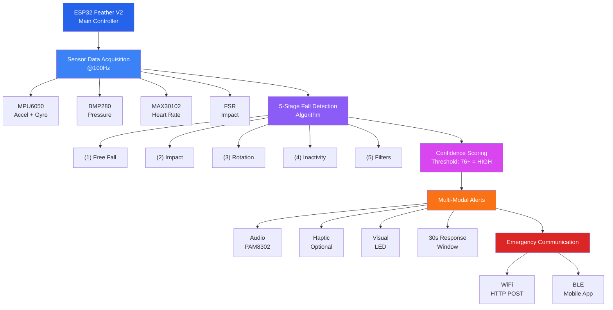

# SmartFall Hardware Documentation

Welcome to the **SmartFall Hardware** documentation. SmartFall is a comprehensive IoT wearable fall detection system using the ESP32 Feather microcontroller with multi-sensor data fusion and emergency alert capabilities.

## <svg class="heroicon" viewBox="0 0 24 24" fill="currentColor"><path d="M12 2C6.48 2 2 6.48 2 12s4.48 10 10 10 10-4.48 10-10S17.52 2 12 2zm0 18c-4.41 0-8-3.59-8-8s3.59-8 8-8 8 3.59 8 8-3.59 8-8 8zm3.5-9c.83 0 1.5-.67 1.5-1.5S16.33 8 15.5 8 14 8.67 14 9.5s.67 1.5 1.5 1.5zm-7 0c.83 0 1.5-.67 1.5-1.5S9.33 8 8.5 8 7 8.67 7 9.5 7.67 11 8.5 11zm3.5 6.5c2.33 0 4.31-1.46 5.11-3.5H6.89c.8 2.04 2.78 3.5 5.11 3.5z"/></svg> Project Overview

SmartFall provides real-time fall detection using a sophisticated 5-stage algorithm that analyzes data from multiple sensors:

- **6-Axis IMU (MPU6050)**: Acceleration and gyroscope data
- **Pressure Sensor (BMP280)**: Altitude change detection
- **Heart Rate Monitor (MAX30102)**: Physiological stress validation
- **Force Sensor (FSR)**: Impact and attachment detection

The system triggers multi-modal alerts (audio, haptic, visual) and sends emergency notifications via WiFi and Bluetooth.

## <svg class="heroicon" viewBox="0 0 24 24" fill="currentColor"><path d="M12 2l3.09 6.26L22 9.27l-5 4.87 1.18 6.88L12 17.77l-6.18 3.25L7 14.14 2 9.27l6.91-1.01L12 2z"/></svg> Key Features

=== "Detection"

    - **5-stage algorithm** with confidence scoring
    - **Multi-sensor fusion** for accurate detection
    - **SOS button** for manual emergency override
    - **Smart filtering** to minimize false positives

=== "Communication"

    - **WiFi** integration for cloud alerts
    - **Bluetooth Low Energy** for mobile app integration
    - **Redundant transmission** for reliability
    - **Auto-reconnect** on network failure

=== "Hardware"

    - **ESP32 Feather V2** with 8MB Flash, 2MB PSRAM
    - **PAM8302 Audio Amplifier** for alerts
    - **4000-5000 mAh** LiPo battery
    - **40-50 hours** estimated battery life

=== "Audio System"

    - **Pre-defined alert patterns** (beeps, sirens, SOS)
    - **Voice-like alerts** for user guidance
    - **Volume control** (0-100%)
    - **Low power consumption** at idle

## <svg class="heroicon" viewBox="0 0 24 24" fill="currentColor"><path d="M5 9.2h3V19H5zM10.6 5h2.8v14h-2.8zm5.6 8H19v6h-2.8z"/></svg> System Architecture

## <svg class="heroicon" viewBox="0 0 24 24" fill="currentColor"><path d="M19.14 12.94c.04-.3.06-.61.06-.94 0-.32-.02-.64-.07-.94l2.03-1.58c.18-.14.23-.41.12-.62l-1.92-3.32c-.12-.22-.37-.29-.59-.22l-2.39.96c-.5-.38-1.03-.7-1.62-.94l-.36-2.54c-.04-.24-.24-.41-.48-.41h-3.84c-.24 0-.43.17-.47.41l-.36 2.54c-.59.24-1.13.57-1.62.94l-2.39-.96c-.22-.08-.47 0-.59.22L2.74 8.87c-.12.21-.08.48.1.62l2.03 1.58c-.05.3-.07.62-.07.94s.02.64.07.94l-2.03 1.58c-.18.14-.23.41-.12.62l1.92 3.32c.12.22.37.29.59.22l2.39-.96c.5.38 1.03.7 1.62.94l.36 2.54c.05.24.24.41.48.41h3.84c.24 0 .44-.17.47-.41l.36-2.54c.59-.24 1.13-.56 1.62-.94l2.39.96c.22.08.47 0 .59-.22l1.92-3.32c.12-.22.07-.48-.1-.62l-2.01-1.58zM12 15.6c-1.98 0-3.6-1.62-3.6-3.6s1.62-3.6 3.6-3.6 3.6 1.62 3.6 3.6-1.62 3.6-3.6 3.6z"/></svg> Hardware Requirements

- **Microcontroller**: ESP32 Feather V2 (or HUZZAH32)
- **Sensors**: MPU6050, BMP280, MAX30102, FSR
- **Audio**: PAM8302 amplifier + 8Ω speaker
- **Power**: 3.7V LiPo battery (4000-5000 mAh)
- **Optional**: Haptic motor, visual LED, push button

## <svg class="heroicon" viewBox="0 0 24 24" fill="currentColor"><path d="M4 6h16v2H4zm0 5h16v2H4zm0 5h16v2H4z"/></svg> Documentation Structure

- **[Getting Started](getting-started/)** - Setup and upload guides
- **[Hardware](hardware/)** - Components and wiring diagrams
- **[Firmware](firmware/)** - Code architecture and module APIs
- **[Algorithm](algorithm/)** - Detailed detection logic
- **[Configuration](configuration/)** - All settings reference
- **[API Reference](api/)** - WiFi and BLE specifications
- **[Testing](testing/)** - Component and system tests
- **[Troubleshooting](troubleshooting.md)** - Common issues

## <svg class="heroicon" viewBox="0 0 24 24" fill="currentColor"><path d="M13 6a3 3 0 11-6 0 3 3 0 016 0zM18 8a2 2 0 11-4 0 2 2 0 014 0zM14 15a4 4 0 00-8 0v3h8v-3zM6 8a2 2 0 11-4 0 2 2 0 014 0zM16 18v-3a5.972 5.972 0 00-.75-2.906A3.005 3.005 0 0119 15v3h-3z"/></svg> Support

For detailed information:

1. Check the relevant section in this documentation
2. Review the [Troubleshooting](troubleshooting.md) guide
3. Test individual components using [Component Tests](testing/component-tests.md)
4. Open an issue on [GitHub](https://github.com/Smart-Fall/Hardware)

## <svg class="heroicon" viewBox="0 0 24 24" fill="currentColor"><path d="M14 2H6a2 2 0 0 0-2 2v16a2 2 0 0 0 2 2h12a2 2 0 0 0 2-2V8l-8-6z"/></svg> License

MIT License - See repository for details

---

**Ready to get started?** → [Quick Start Guide](getting-started/quick-start.md)
